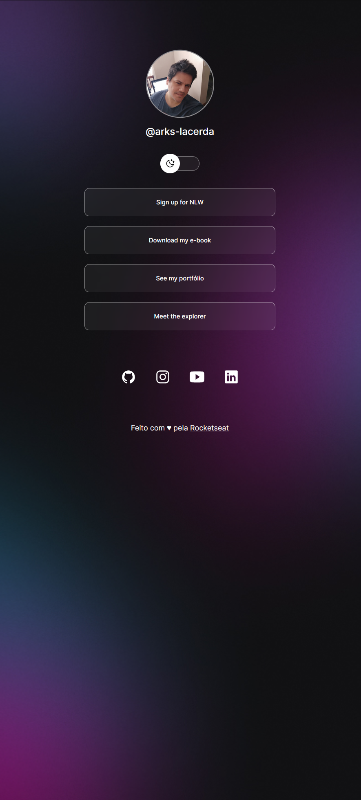

<h1 align="center"> DevLinks </h1>

  
  

## 🚀 Technologies

This project was developed with the following technologies:

- HTML e CSS
- JavaScript
- Git e Github
- Figma

## 💻 Project

DevLinks is a link aggregator to use as an online business card.

- [Access the finished project, online](https://arks-lacerda.github.io/devLinks/)

## 🔖 Layout

Project layout [FROM THIS LINK](https://www.figma.com/community/file/1187422022288947321).
